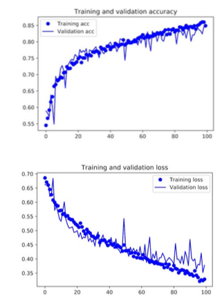
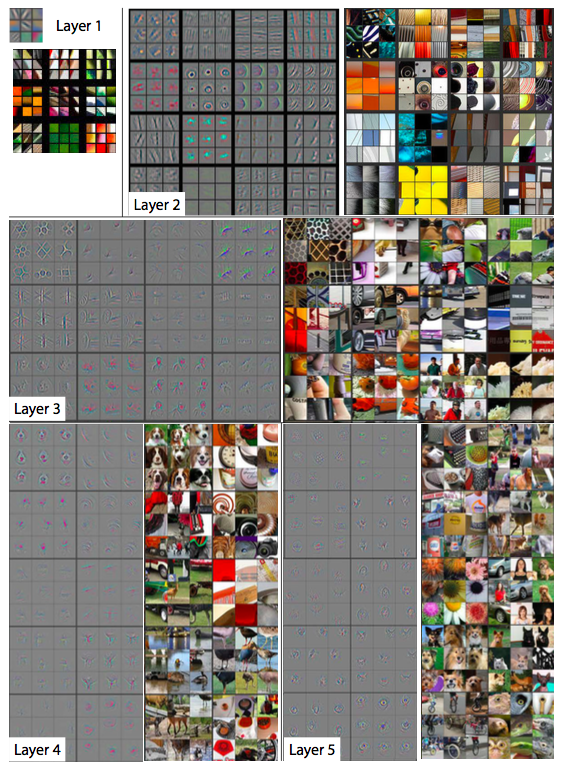
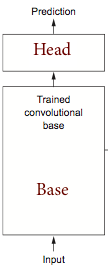
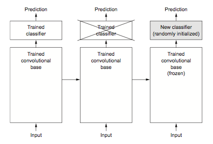
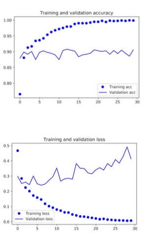
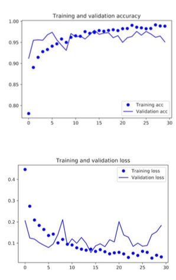
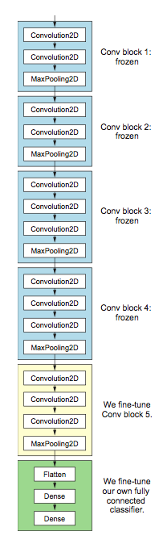
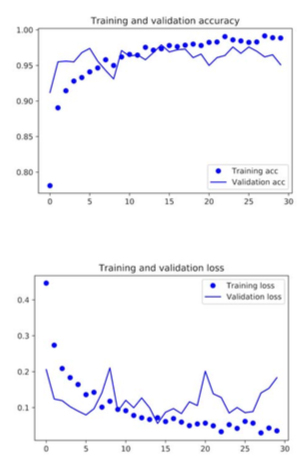

footer:
autoscale: true


---

#[fit] Ai 1

---

##[fit] Data Augmentation

## and

##[fit] Transfer

##[fit] Learning

---

# A dogs-cats classification model

- 900 training, 1000 validation images
- this is a relatively small data set
- it would be hard to train a neural net on this
- **Data Augmentation and Transfer Learning to the rescue**

---


---

## Data Augmentation

Basic Idea: Create (infinitely) more data

- geometrically tansform data: rescale, rotate, shift horizontally and vertically, shear zoom, horizontal flips
- these transformations are range specified and random!
- adds more images and builds in symmetries by training the network with these existent in the data
- acts as a regularization in low data situations
- a strong application of generative models

---

```python
train_datagen = ImageDataGenerator(
    rescale=1./255,
    rotation_range=40,
    width_shift_range=0.2,
    height_shift_range=0.2,
    shear_range=0.2,
    zoom_range=0.2,
    horizontal_flip=True,)
test_datagen = ImageDataGenerator(rescale=1./255) # no augmentation!
train_generator = train_datagen.flow_from_directory(
    train_dir,
    target_size=(150, 150), #Resizes all images to 150 × 150
    batch_size=32,
    class_mode='binary')
validation_generator = test_datagen.flow_from_directory(
    validation_dir,
    target_size=(150, 150),
    batch_size=32,
    class_mode='binary')
```

---


### Training a model for cats and dogs from scratch

Include both data augmentation and dropout regularization since dataset is small!

```python
model = models.Sequential()
model.add(layers.Conv2D(32, (3, 3), activation='relu', input_shape=(150, 150, 3)))
model.add(layers.MaxPooling2D((2, 2)))
model.add(layers.Conv2D(64, (3, 3), activation='relu'))
model.add(layers.MaxPooling2D((2, 2)))
model.add(layers.Conv2D(128, (3, 3), activation='relu'))
model.add(layers.MaxPooling2D((2, 2)))
model.add(layers.Conv2D(128, (3, 3), activation='relu'))
model.add(layers.MaxPooling2D((2, 2)))
model.add(layers.Flatten())
model.add(layers.Dropout(0.5))
model.add(layers.Dense(512, activation='relu'))
model.add(layers.Dense(1, activation='sigmoid'))
model.compile(loss='binary_crossentropy', optimizer=optimizers.RMSprop(lr=1e-4), metrics=['acc'])
```

---

##### The fitting process

```python
train_datagen = ImageDataGenerator(
    rescale=1./255,
    rotation_range=40,
    width_shift_range=0.2,
    height_shift_range=0.2,
    shear_range=0.2,
    zoom_range=0.2,
    horizontal_flip=True,)
test_datagen = ImageDataGenerator(rescale=1./255) # no augmentation!
train_generator = train_datagen.flow_from_directory(
    train_dir,
    target_size=(150, 150), #Resizes all images to 150 × 150
    batch_size=32,
    class_mode='binary')
validation_generator = test_datagen.flow_from_directory(
    validation_dir,
    target_size=(150, 150),
    batch_size=32,
    class_mode='binary')
history = model.fit_generator(
    train_generator,
    steps_per_epoch=100,
    epochs=100,
    validation_data=validation_generator,
    validation_steps=50)
```



---

## How a convnet learns



- there is expressivity at multiple levels in network hierarchy to capture representations
- this representations feed into your classification: indeed, they are particularized to your **downstream task**, in this case, the dogs-vs-cats classifier.
- it may be, however, that **features learnt on a particular downstream task are useful on another**
- this *portability* of features a key advantage of deep learning
- small datasets are not adequate for this: the representations learned may not be rich enough
  
---
[.footer: From [Ruder](http://ruder.io/transfer-learning/)]

## Traditional machine learning


---
[.footer: From [Ruder](http://ruder.io/transfer-learning/)]


---

## Multi-Task vs Sequential Transfer Learning

- the previous scenario is that of sequential transfer learning, where we train on one task, and transfer knowledge to another task or domain
- in multi-task learning, we train tasks together, thus preventing the model to particularize to any one task (a form of regularization)
- an example of this is multiple tasks used to learn embeddings in the BERT model.

---

## Applications

- learning from simulations (self driving cars)
- domain adaptation: bikes -> bikes with backgrounds, bikes at night, etc
- speech recognition for immigrants and minorities
- cross-lingual adaptation for few shot learning of resource poor languages (english->nepali for example)

---

## Sequential Transfer learning: Using a pre-trained net

- you want to create a specific classifier, say dogs vs cats
- you use a convnet previously trained on a large dataset, something quite expensive for you to learn
- for example, Imagenet, with 1.4 million labeled images and 1000 classes. Imagenet has revolutionized Computer Vision, and representations learnt from imagenet are used in many downstream tasks, such as segmentation, object detection, and human pose estimation
- in NLP, you might use a language model trained on wikipedia and reddit, and then look at legal documents. NLP had its "Imagenet Moment" last year, with pre-trained models such as GPT, BERT, and ULM-Fit

---


## Representation Extraction



---

- Use representations learned by big net to extract features from new samples, which are then fed to a new classifier
- keep (frozen) convolutional **base** from big model
- generally throw away **head** FC layers since these have no notion of space, and convolutional base is more generic
- since there are both dogs and cats in imagenet you could get away with using the head FC layers as well
- but by throwing it away you can learn more from other dog/cat images

---

```python
from keras.applications import VGG16
conv_base = VGG16(weights='imagenet',
                  include_top=False,
                  input_shape=(150, 150, 3))

for inputs_batch, labels_batch in generator:
    features_batch = conv_base.predict(inputs_batch)
    features[i * batch_size : (i + 1) * batch_size] = features_batch 
    labels[i * batch_size : (i + 1) * batch_size] = labels_batch
    i += 1
    if i * batch_size >= sample_count:
        break
return features, labels
```

- Now run once over your dataset, and save the output to disk, using these as features for any classifier.

---

## Fully Connected Classifier

```python
from keras import models
from keras import layers
from keras import optimizers
model = models.Sequential()
model.add(layers.Dense(256, activation='relu', input_dim=4 * 4 * 512))
model.add(layers.Dropout(0.5))
model.add(layers.Dense(1, activation='sigmoid'))
model.compile(optimizer=optimizers.RMSprop(lr=2e-5),
              loss='binary_crossentropy',
              metrics=['acc'])
history = model.fit(train_features, train_labels,
                    epochs=30,
                    batch_size=20,
                    validation_data=(validation_features, validation_labels))
```
- depending on the size of your data set, you will find that you are likely overfitting
- training-time data augmentation is key additional regularization
  


---

## Feature/Representation Extraction with Data Augmentation

Combine the conv base and a FC head:

**Freeze the convolutional base**. This means weights in the convolutional base are considered fixed: we dont move through that part of the parameter space.

- Why? Since the FC net has randomly initialized weights, large gradient changes will happen at the beginning of training. 
- These will change pre-trained weights a lot if we did not freeze them, [destroying the representations](https://www.pnas.org/content/114/13/3521) learnt on the big net.

Now we can add back the random augmentation on the *training* set

---

#### Fit with fixed base and augmentation

```python
from keras import models
from keras import layers
model = models.Sequential()
model.add(conv_base)
model.add(layers.Flatten())
model.add(layers.Dense(256, activation='relu'))
model.add(layers.Dense(1, activation='sigmoid'))
conv_base.trainable = False
...
model.compile(loss='binary_crossentropy',
    optimizer=optimizers.RMSprop(lr=2e-5),
    metrics=['acc'])
history = model.fit_generator(
    train_generator,
    steps_per_epoch=100,
    epochs=30,
    validation_data=validation_generator,
    validation_steps=50)
```



---

## Fine-tuning

- upto now we have frozen the entire convolutional base
- remember that earlier layers learn highly generic feature maps (edges, colors, textures)
- later layers learn abstract concepts (dog's ear)
- to paticularize the model to our task, its often worth tuning the later layers in the conc base as well, but not the earlier layers
- but we must be very careful not to have big gradient updates.



---

## Procedure for fine tuning

1. freeze the convolutional base
2. first train the fully connected head you added, keeping the convolutional base fixed. This will get their parameters away from random and in a regime of smaller gradients
3. unfreeze some "later" layers in the base net and 
4. Now train the base net and FC net together
   
Since you are now in a better part of the loss surface already, gradients wont be terribly high, but we still need to be careful. Thus use a **very low learning rate**.

---

```python
conv_base.trainable = True
set_trainable = False
for layer in conv_base.layers:
    if layer.name == 'block5_conv1':
        set_trainable = True
    if set_trainable:
        layer.trainable = True
    else:
        layer.trainable = False
model.compile(loss='binary_crossentropy',
    optimizer=optimizers.RMSprop(lr=1e-5),
    metrics=['acc'])
history = model.fit_generator(
     train_generator,
     steps_per_epoch=100,
     epochs=100,
     validation_data=validation_generator,
     validation_steps=50)
```



---

## Differential Learning rates


- A really low learning rate can take a lot of time to train on the "later" layers. Since we trained the FC head earlier, we could probably retrain them at a higher learning rate.
- General Idea: *Train different layers at different rates*
- Each "earlier" layer or layer group (the color coded layers in the image) can be trained at 3x-10x smaller learning rate than the next "later" one.
- One could even train the entire network again this way until we overfit and then step back some epochs.

---

## Modifications as per current training SOTA

- we could use a cyclic learning rate
- we can use SGDR (SGD with warm restarts)
- both may be combined with the **learning rate finder** from the cyclic learning rate paper. 
- we can do 1-cycle learning with a cosine-annealed learning rate extinction
- we can implement schedules for other hyperparameters such as dropout and weight decay
  
---

## Recap of training process.

1. freeze the convolutional base
2. first train the fully connected net you added, keeping the convolutional base fixed. This will get their parameters away from random and in a regime of smaller gradients
3. unfreeze some "later" layers in the base net and 
4. Now train the base net and FC net together using differential learning rates
5. Use differential learning rates after unfreezing the entire network
6. The learning rates may be learnt using a learning rate finder and used with a 1-cycle policy or warm restarts

---

## Transfer Learning and NLP

- NLP has used language modeling (skip-gram in word2vec, foe eg) to pre-train word embeddings
- But now NLP is moving to "pretraining the entire model with hierarchical representations. If learning word vectors is like only learning edges, these approaches are like learning the full hierarchy of features, from edges to shapes to high-level semantic concepts."- [Ruder](http://ruder.io/nlp-imagenet/)
- Problem: NLP Models tend to be much shallower
- Language Modeling seems to have been the breakthrough task for ELM, ULMFit, and GPT, but see BERT


